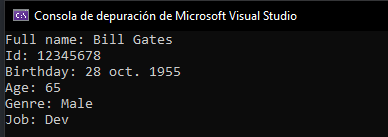

# Test 3
### Tarea:
Crear una clase que represente un objeto persona con las características básicas como Fecha Nacimiento, Nombre, etc..
### Resolucion:
Una clase `Person` con lo que considere las caracteristicas basicas para este ejercicio, la misma posee un metodo `GetPersonData()` el cual despliega en consola la info de la persona.  
  

